# Tournav
Tournav is a site that give the tourists the most beautiful places where they can enjoy and spend their time. Also Tournav gives recommendations regarding hotels, travel agencies, and airlines so the tourists can have the best experience and satisfaction in their journey.

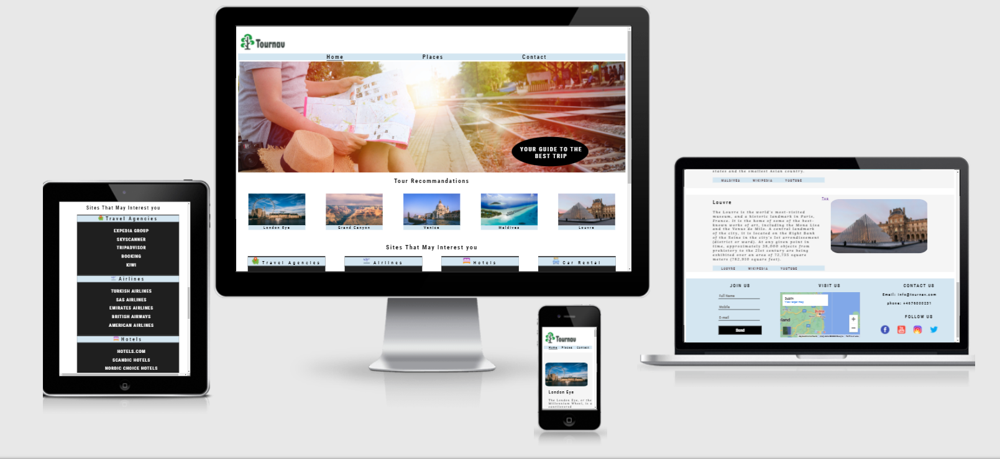

# Features

### Existing Features

 __Navigation Bar__

- Special Navbar on all pages, the full responsive navigation bar includes links to the Home page, Places page and Contact and is identical in each page to allow for easy navigation.
- Navbar will allow the user to easily navigate between pages on all devices.

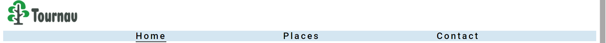

__The giude page image__

- The giude page image with a text in this site  expressing the appropriate direction of the tourist places. 
- The selected image matches the page's topic.

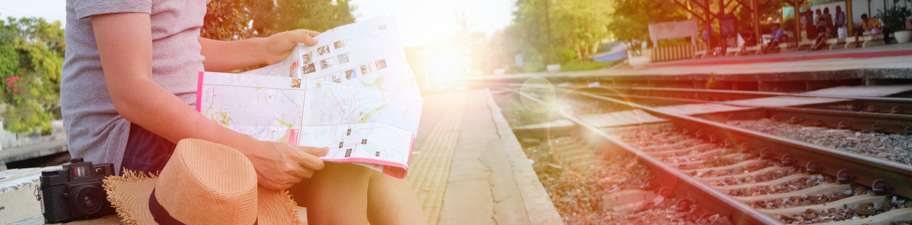

__Tour Recommandations Section__

- This section have the places section, its give five of the best choices of the most beautiful places in the world which the tourist should visit.

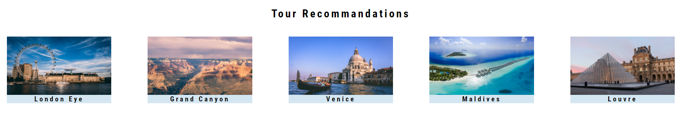

 __Interest Sites Section__

 - This section has the most useful links that a tourist can use regarding travel agencies, hotels, airlines, and car rental agencies.

 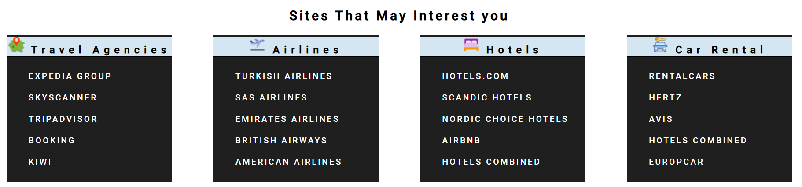

  __Footer__

  - This footer have four options to comunicate with Tournav page (Join us, Visit us, contact us and follow us).

  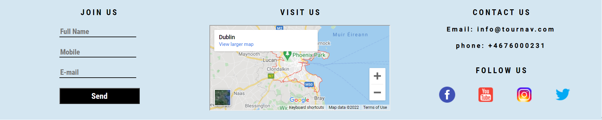

   __Places__

   - This page have places that is recomaded by tournav.
   - Every section have one place with photo and breif discription with three links related to it.

   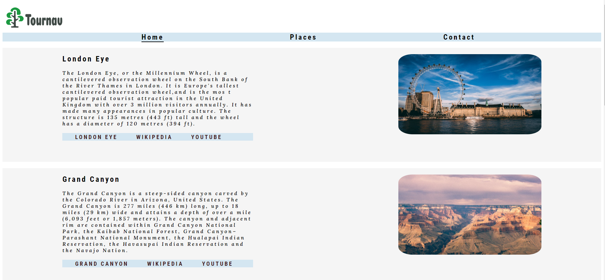

## Testing

### Validator Testing
HTML
- No errors were returned when passing through the official W3C validator.

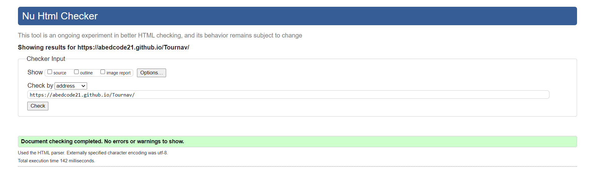

CSS
- No errors were found when passing through the official (Jigsaw) validator.

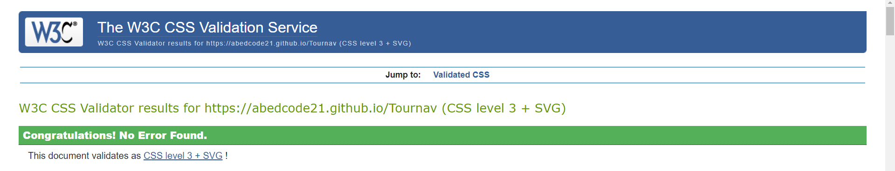
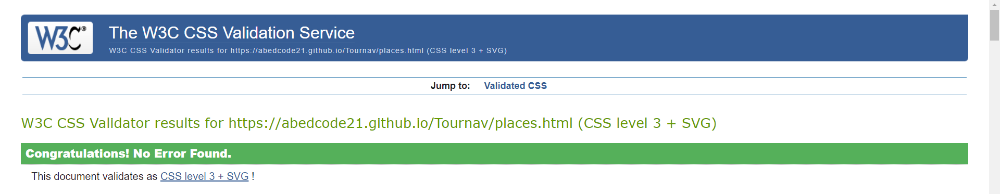

## Credits

### Content
- The text for the Home page and places page was taken from Wikipedia Article A.
- The icons in the footer were taken from icons8.com.
- The font in the home page and places page was taken from Googe font.

### Media 

- The photos used on the home page and page were taken from Open Source site (pexels.com).
- The images used for the places page were taken from This Open Source site (pexels.com).

## Accessibility

- Hmoe page

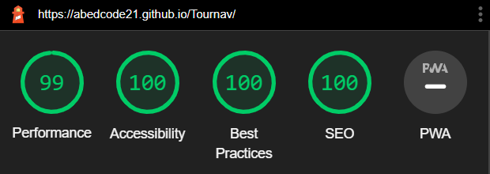

- Places page

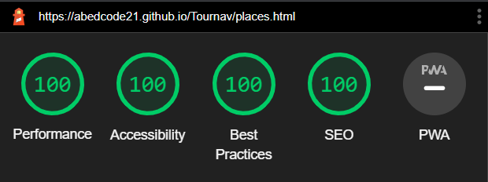

- The accessibility score which was calculated with the Lighthouse tool within the Chrome Developer tools shows that the
   website  is highly accessible for screen readers.
- The performance score can vary heavily, depending on which computer was used for testing (I tested on several devices and 
  this was the best score I got).

